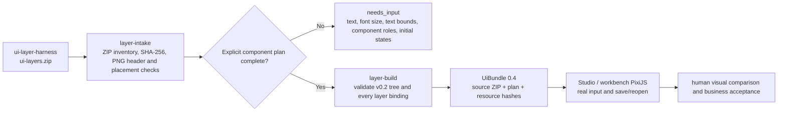
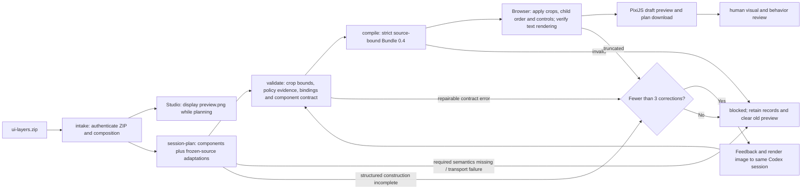

# `ui-layers.zip` → UI component bundle

This is the direct consumer for `ui_layers_package_v1` / `ui_layer_composition_v1`. It is separate from the decomposition `scene.json` and `assets.zip` handoff. The layer package owns raster bytes, canvas size, order and original placements. The component Harness owns the v0.2 tree, text, states, hit targets and PixiJS runtime.



Run `npm run build` in this package before using the checkout CLI, then:

```sh
node scripts/cli.mjs layer-intake ui-layers.zip --output intake.json
node scripts/cli.mjs layer-build ui-layers.zip --plan component-plan.json --output component.ui-bundle.json
node scripts/cli.mjs validate component.ui-bundle.json
```

The local Studio also supports this route directly. Open the page and choose **导入图层交付 ZIP**, then **Codex 生成组件方案并预览**. `/api/ui-layer-plan` reauthenticates the exact ZIP on the server and uses an optional local Codex CLI session to read the original reference, layer composite, every layer PNG, verified geometry and the public component contracts. Codex returns a complete `model-proposed` plan across the 16 supported types, including hierarchy, text, typography, initial states and bindings. The deterministic DAG validates that proposal and compiles Bundle 0.4 for Pixi preview. **下载组件方案草稿 JSON** saves the plan with portable decision evidence. Alternatively choose an explicit plan JSON and use **按所选方案生成 Bundle 并预览**. The existing **导入组件交付 ZIP** and **导入拆分 ZIP** buttons accept different handoff formats.

After successful ZIP intake, Studio immediately shows the authenticated **preview.png** in the Pixi canvas as **交付包预览**. This static image stays visible while a plan is selected or generated. Bundle export, motion presets and comparison are unavailable until a complete component plan passes checks and replaces the image. Importing a ZIP alone makes no model request; invalid replacements and reset clear the preview.



One click sends one HTTP planning request. The optional local adapter runs an initial Codex turn and **at most three automatic correction turns**, at most four model turns total, using the same exact verified session ID. Each completed draft is independently validated, compiled and rendered in a local headless Pixi browser using actual system fonts. Repairable contract/evidence errors and implicit text overflow are sent back with bounded deterministic feedback and a render image when available. A corrected full proposal is checked again; the first passing draft ends the loop. Three still-failing corrections return `SESSION_CORRECTIONS_EXHAUSTED` and disable exports. This limit is fixed in the adapter, never taken from untrusted ZIP content or browser input.

Native response version **1.1** requires `reason` and `missingInputs`. Programs
use these structured fields, without classifying free-text explanations:

| Reason | Required payload | Program behavior |
| --- | --- | --- |
| `none` | Draft, complete plan, `missingInputs: []` | Validate, compile and render. |
| `construction-incomplete` | `missingInputs: []`; plan may be null | Return a repairable completeness error even if status is Unresolved; continue in the same session within the shared three-correction budget. |
| `required-semantics-missing` | Unresolved, null plan, one or more specific missing inputs | Terminal stop, display concrete missing inputs. |

Each missing input is `{subject,kind,detail}`, with kind `unreadable-text`,
`unknown-value` or `unknown-component`. Empty missing-input claims, unknown
reason/kind, contradictory payloads and private notes fail validation. Missing
raster parts, typography proposals and unfinished mapping/evidence work do not
qualify as missing semantics. Incomplete plans are never compiled or exported.
The three corrections are shared with later contract/render failures; switching
failure kinds does not reset the budget. Exhaustion retains its portable
construction diagnostic, clears output and preserves the checked ZIP.

Historical version 1.0 responses and bundles remain readable. Historical
Unresolved has no structured reason, remains terminal, and is never interpreted
from its prose or automatically restarted. Deterministic collection verifies the
exact schema version and original correction prompts from each run's receipt.

## Frozen-source consumer adaptation

Upstream is not asked to revise a delivered ZIP. Native planning receives the
explicit `LAYER_ADAPTATION_POLICY_V1` and returns `adaptations` in the component
plan. Deterministic validation/compiler/runtime own the implementation; Codex
does not edit images or invoke tools. Operations use existing v0.2 contracts:

| Operation | Declaration | Runtime behavior |
| --- | --- | --- |
| Source crop | `{kind: "crop", componentId, sourceLayerId, reason}` | Image.region samples the authenticated original PNG; separate target layout places it. |
| Child order correction | `{kind: "reorder", componentId, reason}` | The declared composite parent's child array paints back to front, e.g. opaque card before fish artwork. |
| Procedural control | `{kind: "procedural-control", componentId, reason}` | A real supported control uses explicit style/state without raster appearance or backgroundImage. |

Every crop needs an explicit-policy finding at `/props/region`. Every actual
control without raster appearance/backgroundImage needs a procedural declaration
and explicit-policy finding at `/props/style`. Every reordered parent needs an
explicit-policy finding at `/children`. Crop bounds are checked against
the source layer dimensions before rendering. Undeclared crops/controls, unknown
sources, false operation types, duplicate operations and private reasons fail.
The plan/bindings still account for every source layer. Optional `adaptations`
extends plan 1.0; existing plans without this field remain valid. Current native
requests require the array, including an explicit empty array when no operations
apply. Bundle 0.4 persists and revalidates its canonical digest and exact source ZIP.

For fused header/progress artwork, retain regions outside the entire baked
track/fill and place a real procedural ProgressBar in the excluded rectangle.
Its readable value/max remain semantic input. The existing renderer uses
style.backgroundColor for the track and style.borderColor for the dynamic fill.
The replacement's visuals are disclosed proposals; partially filled source art
must not be declared a full-range fill. No new image files or derived raster
producer is introduced. Missing raster parts alone can be handled by this policy;
unreadable required semantics and other terminal failures still stop without retry.

Studio lists adaptation reasons for review. Bounded, portable Unresolved
summary/issues now reach the page as **组件方案未完成**, preserving the checked
ZIP while clearing failed component output and disabling exports. No raw CLI
events, host paths, credentials or automatic new request are exposed.

This route no longer uses `/api/ui-vision`, MCP `vision`/`get_task`, or the old Panel/Button matching and proportional font rules. The public DAG accepts a provider-neutral planning callback; its `automaticRetries: 0` refers to resubmitting that callback after errors, while the optional adapter's execution receipt separately reports `maxCorrections:3`, actual `corrections` and `modelTurns`. The adapter disables tools, MCP plugins/apps, shell execution, image generation, project instructions, host skills and web access on every initial/resumed turn and verifies one completed turn per invocation with no tool events. It resumes only the verified session explicitly; no `--last`, fork, hidden model selection or new-session repair. Authentication, source mismatch, unresolved required semantics, timeout, cancellation, incomplete/failed transport, unknown tool events and renderer infrastructure failure remain terminal with zero automatic transport resubmission.

New CLI invocations terminate at the first observed reconnect, transport fallback,
sampling-disconnect or login-failure notice, including native stderr warnings that
precede JSONL error events. The Harness kills that process and never starts a
second invocation to recover transport. This is an observed-error guard; it cannot
prove that no request was accepted before the CLI reported the error. Collection
of historical completed receipts still recognizes their original bounded
connection notices; it launches no process and grants no new retry authorization.

During a live invocation the adapter checks each complete stdout event as it
arrives, preserving UTF-8 across chunk boundaries and retaining the raw local
event bytes. Any live transport notice terminates that process as
`SESSION_TRANSPORT_FAILED_NO_RETRY`; unknown/tool events terminate as isolation
failure. The final completed-turn/session checks still run before any draft is
accepted. This prevents a failed response stream from continuing through another
CLI reconnect cycle until the 15-minute timeout. Existing historical receipts
keep their original failure codes. Studio separately explains timeout, transport
failure and cancellation and disables draft/Bundle exports after each failure.
Each new turn also saves `io-timing.json` with elapsed times for stdin completion,
first/last stdout and stderr, turn events, termination and process close. These
are local CLI pipe timings, not network request, first-byte or stream-idle timings.
They contain no prompt, credentials, host paths or model output.

For explicit Node-side loopback verification, use
`requestLocalLayerPlan(origin, archiveBytes, options)` from
`scripts/studio-layer-client.mjs`. It sends one authenticated request using
Node HTTP with an explicit run deadline and a short response grace period.
Generic Node fetch has a separate five-minute headers timeout that can cancel a
valid multi-turn request despite a longer AbortSignal deadline. Cancellation,
timeout, malformed/oversized response or connection failure never triggers a
second request. This helper does not authorize model compute; it is only for
already requested local execution. Browser Studio keeps its existing transport.

Model text must be marked observed; unreadable required labels block instead of being invented. Model typography, text boxes and initial states are proposals when upstream facts are absent. Each node type/layout and each semantic/state/typography/text-region field has explicit `observed`, `inferred`, or `explicit-policy` evidence. Inferences and decisions are displayed for review and persisted in the plan. The exact archive/reference digests and canonical proposal digest bind that evidence to the input. Session IDs, host paths, credentials and raw transport logs are excluded from bundles; local session records stay under ignored `.tmp/layer-planning-sessions/`. Automatic output is always `draft_pending_visual_review`, never upstream or human visual acceptance. Terminal failures and exhausted corrections clear the old preview and disable exports. The explicit JSON path remains available.

## Local Codex setup

Install the Codex CLI separately and authenticate using `codex login`. Verify with `codex login status`. The bridge discovers the executable on PATH (a native `.exe` on Windows); an optional local `.env.local` can set `UI_COMPONENT_CODEX_COMMAND` to an absolute executable path and `UI_COMPONENT_CODEX_MODEL` / `UI_COMPONENT_CODEX_EFFORT` to explicit model settings. These are server-only settings, never `VITE_` values or bundle fields. No model or effort is hard-coded; absent overrides use CLI defaults. Planning uses `--ignore-user-config`, so personal model/effort settings are not inherited: specify the two local Harness settings explicitly when matching an existing configuration. Every initial/resumed invocation uses `--no-daemon` so it runs in its own child process rather than reusing the shared background server. Proxy configuration remains operator-owned and must be available to the bridge process; this adapter never changes global network settings. Existing login state remains owned by Codex. Before each planning dispatch, a local login-status check blocks missing authentication without contacting a model. GET `/api/ui-layer-plan` reports executable availability and busy state only; `configured:true` does not prove login or provider reachability.

Both `npm run dev` and `npm run preview` install the same loopback-only bridge. POST requires the exact same browser Origin and authenticated source ZIP, rejects concurrent requests, and bounds request/output sizes. Each model turn is limited to 15 minutes, each render check to 45 seconds, and the entire run to 63 minutes; closing/resetting the view aborts the active process/browser. Each click creates a fresh local directory after login preflight. `run.json` and exact source images are stored once; immutable `turn-0` through at most `turn-3` directories retain dispatch, prompt/schema, structured draft, events/stderr, verified session, feedback, render PNG/report and check evidence. Root `result.json` records the terminal outcome. These contain private operational data and must not be copied into releases. Browser API v2 returns only the final proposal and portable execution counts; Studio displays actual corrections. The checker uses the locally installed browser and blocks external/API requests. Automated tests use response/process doubles and local rendering, never the signed-in model.

An already completed response can be collected deterministically through the optional local adapter's `collectCodexLayerPlan(archiveBytes, executionDirectory)`. Collection supports original single-turn records and completed correction runs. It verifies prompt/schema and source digests, every same-session turn, exact final-message/output correspondence, the feedback chain, render report/image digests and final check evidence. It performs no process launch or model dispatch. Persist collection artifacts to a fresh directory and preserve all original receipts. This cannot recover an incomplete turn or repair a rejected plan.

## Text render acceptance

UI component delivery also includes explicit internal state linkage. Fresh native
plans must classify every Button through [button interactions](button-interactions-v1.md):
known close/cancel/details/numeric controls execute UI effects, while genuinely
unknown host navigation/business actions have explicit external reasons. The
local renderer exercises internal effects with actual pointer input, checks
activation and resulting states, and restores the initial rendering. Unreachable
controls or missing modal exit paths block the new draft; declarations or event
counts alone are insufficient. Keyboard, boundary and export/reopen checks remain
part of component acceptance. Old plans/Bundle behavior remains compatible.

Source and contract validation cannot measure a system font. Studio and the workbench additionally reject a `model-proposed` plan when actual initial rendering truncates an implicit component label/title, with `LAYER_PLAN_TEXT_OVERFLOW`. The failed view is torn down and exports are disabled. Explicit Text-node overflow policies retain their contract behavior. An Input may declare `valueOverflow:'ellipsis'` with an `explicit-policy` finding to retain long editable values across export/reopen: only measured horizontal overflow of its non-empty value is allowed, and the resulting ellipsis must fit. Placeholders, vertical overflow and all other implicit labels remain subject to the gate. The renderer retains the truncation, requested value, overflow axis and actual glyph bounds; layout checks still run. Font fitting, text alignment, raster differences and human visual approval remain separate checks; passing this gate alone is not visual acceptance.

Built-in labels begin at the text region's left edge, center vertically and use `fontSize * 1.25` line height in target component units. Raster label/title regions scale with their source canvas; font size does not scale implicitly. Centered Button text can use the public `appearance.labelLines` extension, which requires explicit alignment, target-local rectangles and evidence for each line's text/font/layout decisions. A native planning run exposed a 78px title in a 90px-high region, producing an ellipsis despite a valid tree. That raw draft is preserved as failed visual evidence; it is not promoted to an accepted Bundle or silently repaired.

`layer-intake` is read only. It reports the exact archive SHA-256, canvas, layer IDs/paths/placements and upstream review issues. It always reports `componentStatus: needs_input`, `imageDecode: not_run` and `humanVisualAcceptance: false`. It does not infer Button or Panel from filenames, and does not restore removed text.

The plan is a JSON object with these fields and explicit evidence/adaptation attachments:

| Field | Meaning |
| --- | --- |
| `kind`, `version` | `ui-layer-component-plan`, `1.0` |
| `archiveSha256` | Exact digest from `layer-intake` |
| `basis` | `agent-reviewed`, `model-proposed`, legacy `vision-proposed`, or `programmatic-fixture`; none alone claims visual acceptance |
| `requirements` | Nonempty source and decision note, at most 500 characters |
| `document` | Complete [v0.2 UiDocument](tree-contract.md), including explicit component types, hierarchy, placement, text, style, initial state and any component linkages |
| `bindings` | One entry per image reference in `document`: `{ "layerId": "...", "pointer": "/root/.../props/..." }` |
| `unusedLayers` | Every intentionally unused source layer: `{ "layerId": "...", "reason": "..." }` |
| `adaptations` | Crop, corrected child order and procedural-control declarations. Required in current native proposals, including `[]` when none apply; legacy plans may omit it. |
| `layoutChecks` | Source-bound explicit text/text and text/icon separation rules and reasons for unpaired Text. Required in new native proposals; historical plans may omit it. See below. |
| `planningEvidence` | Required for `model-proposed`; `{version:'1.0',referenceSha256,responseSha256,findings,issues}`. Each finding is `{componentId,pointer,basis,note}` with a node-relative JSON Pointer. Other existing plans may omit it. |

Pointers use JSON Pointer syntax relative to `document`. Each must point to an image resource path in the exact ZIP. Every image reference must be bound; every source layer must be bound at least once or have an explicit unused reason. A layer can be used in multiple visual states. External images and font files are rejected on this route because they are not authenticated by the source ZIP. System font family and font size remain explicit in the v0.2 document. The source ZIP is capped at 64 MiB; ordinary bundle resource caps also apply.

Image fields use the exact authenticated `layers[].path`, such as
`layers/layer-003.png`. Layer IDs belong only in `bindings[].layerId` and
`adaptations[].sourceLayerId`; bindings do not resolve aliases. A draft that puts
an ID in an image field remains rejected. Deterministic feedback identifies the
field and, when the ID matches an authenticated layer, its required resource path.

For a Button with separate art and semantic text, bind its layer to `/root/children/0/props/appearance/backgroundImage`; supply `appearance.sourceCanvas`, `appearance.labelLayout`, `props.label` and `props.style.fontSize` explicitly. An icon-only Button can explicitly use an empty label. A pure Image uses `/root/children/0/props/source`. The exact pointer depends on the authored tree. A Button emits `activate` with its component ID. The game maps that event to an action when integrating the bundle; no game action ID is required to build or test the UI component. Other component events remain governed by the v0.2 runtime and any explicit component linkages. This route accepts all 16 existing v0.2 node types through the ordinary contract and runtime; it does not invent all 16 from one image.

`layer-build` writes a verified bundle 0.4 and refuses an existing output. The bundle retains exact source ZIP bytes, the plan and its canonical SHA-256. On every reload/export, validation reimports the ZIP and recompiles the plan; edited component structure, source bytes, resource bytes or source evidence are rejected. Existing runtime value fields and linkage state may change during real interaction. Motion attachments remain separate validated inputs.

Bundle 0.4 cannot be used as the semantic target of the separate decomposition/assets appearance builder. Rebinding artwork would invalidate this package's exact source and plan evidence; author a new plan from the new source instead.

**Acceptance boundary:** ZIP integrity and component contract validity establish technical intake only. The upstream package can still contain crop or resampling warnings. The source package does not provide text boxes, font metrics or complete state art. The plan author must supply text and component decisions from reviewed evidence and user requirements. Game actions are a separate integration concern. Test the resulting bundle in a real browser, compare to the reference, and record human visual acceptance separately. A successful `layer-build` never asserts that approval.

## Declared layout measurements

`layoutChecks` extends plan 1.0 with a strictly validated optional field. Existing
Bundle 0.4 packages without it remain readable; they gain no measured separation
claim. New native proposals must declare it. It participates in the canonical
plan digest and is preserved/revalidated during compilation, export and reload.

```json
{
  "version": "1.0",
  "separations": [
    { "id": "name-count", "firstId": "name", "secondId": "count",
      "axis": "y", "minGap": 4, "reason": "Name is above its count; proposed four-pixel spacing." },
    { "id": "icon-caption", "firstId": "icon", "secondId": "caption",
      "axis": "x", "minGap": 4, "reason": "Icon precedes caption; proposed four-pixel spacing." },
    { "id": "tab-count", "firstId": "pond-tabs", "firstText": "Mountain Pond", "secondId": "pond-count",
      "axis": "y", "minGap": 4, "reason": "Exact built-in tab label sits above its count." }
  ],
  "unpairedText": [
    { "componentId": "standalone-title", "reason": "Independent title; no adjacent spacing relation declared." }
  ]
}
```

Each relation uses two distinct existing IDs, including at least one text
endpoint. Text/Image endpoints use IDs alone. A Button, Panel, Dialog or Tabs
endpoint additionally uses `firstText`/`secondText` to select one unique, exact,
nonempty owned label/title/tab-label string already in that node's contract.
Unknown or repeated selectors fail; no glyph index, filename or guessed text
is used. `x` means the first is left of the second, `y` means it is above
the second. Minimum gaps are explicit finite nonnegative **canvas pixels**;
four pixels in the example is a proposal, not a global default. Every nonempty
explicit Text must occur in a relation or have an unpaired review explanation.
Unknown fields/IDs, self-pairs, duplicate IDs/pairs, private reasons, invalid gaps
and incomplete coverage fail contract validation. Built-in labels/titles also
retain the separate overflow gate. Backgrounds and decorated frames are not
automatically paired.

The browser measures nested `renderedTextBounds[].bounds`, unions actual Text
glyph rectangles, and uses the Image target rectangle including transparent
margins. It computes signed gaps in canvas coordinates; a negative gap is overlap.
Only a 0.000001-pixel allowance absorbs floating-point transform noise. Missing,
duplicate or nonfinite measurement evidence is a terminal render failure, never
a passing no-overlap result. A hidden endpoint produces an explicit
`skipped-hidden` result. These checks cover the loaded state and declared relations;
they do not assert all states, pixel-visible icon bounds, alignment quality,
unpaired spacing, texture continuity or human visual acceptance.

Text rectangles come from Pixi layout metrics, not an independent glyph-alpha
scan. Measurement canvases and detached raster canvases explicitly use the same
document language when resolving generic fonts; otherwise different fallback
fonts can produce a texture narrower than its painted text. Browser regressions
compare raster-context advance/ink bounds with the texture frame and scan painted
pixels outside that frame. These regressions cover the reproduced font-language
failure; a passing layout relation alone does not prove glyph raster completeness.

`LAYER_PLAN_LAYOUT_GAP` returns actual rectangles, measured gaps, required gaps,
component IDs, portable issues and a render PNG. The same verified native session
uses the existing shared three-correction budget for this feedback, text overflow,
unfinished construction and contract errors. New completed corrections cannot
remove a relation, change its endpoints/axis, lower its gap or hide a previously
measured relation. Added/strengthened relations remain binding on later turns.
The original drafts, render reports, images, prompts and checks remain preserved.
Source mismatch, transport failure and renderer infrastructure errors remain
terminal. Deterministic collection rechecks the stored policies and measurements
without contacting a model. Historical run receipts retain their original scope.

Planning instructions also require restricted blank-paper patches, explicit icon
crops/draw order, safe text spacing, common Tabs template geometry with native
icon dimensions, disclosed fixed baked highlights, and complete removal of baked
progress state. These are model planning requirements and visual review items;
the separation gate does not claim to verify those pixel semantics automatically.

List and Tabs can explicitly declare independent state raster sizing; List can
also own a separate dynamic selection indicator and selected label color. See
[state templates](state-templates.md). Each source keeps its exact decoded
dimensions. These fields require explicit-policy findings; absent policies retain
the previous strict same-size checks. No raster bytes are synthesized or replaced.

Empty native labels paint no glyphs or ellipsis. A separate Text child may own the
visible heading, with its original strict overflow and layout checks. Actual paint
inspection measures Graphics mask geometry directly because Pixi marks mask
objects unmeasurable for ordinary container bounds. Masked row/icon/text regions
stay measurable and clipped; renderer flags and gate targets are unchanged.

## Installed consumer entries and explicit initial facts

Package 0.2.0-rc.2 includes compiled planning/render adapters, an isolated local
check host, and separate typed/browser standalone entries. Explicit initial user
facts may be bound to the plan with a canonical digest; every proposed initial
value is verified before compilation and the original facts survive Bundle 0.4
state saves. This supplies no missing defaults or execution authorization.
See [installed runtime contract](consumer-runtime.md) for entry APIs, semantic
fields, immutable versus saved values, and the actual packed/source regression.
