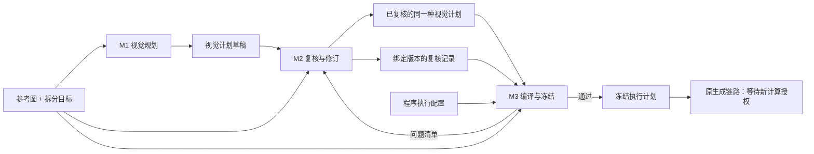

# UI Planning 子 Harness：三个模块、两个核心合同

**状态：合同及离线校验已有独立预览实现。** 可调用入口见
[UI Layer Harness](../../ui-layer-harness/README.md)。本目录定义规划合同，
不替代现有正式 CLI；以下迁移讨论不是旧生产链路已经切换的声明。

## 模块与输入输出

| 模块 | 负责什么 | 输入 | 输出 | 谁消费 |
|---|---|---|---|---|
| M1 视觉规划 | 看图，提出素材区域、对象归属与前后顺序 | 参考图 + 拆分目标 | **视觉计划 JSON 草稿** | M2 |
| M2 复核与局部修订 | 检查重要漏件、错误分组、明显边界及遮挡问题；有问题才局部修订 | 原图 + 目标 + 计划 + 素材标框 + 可选对象辅助标框 + 程序问题 | **问题清单**；需要时产生同一种计划的新版本及复核记录，无问题则复用原计划 | M3 或局部修订 |
| M3 编译与冻结 | 把已复核的视觉计划转成固定生成任务，执行检查并冻结 | 参考图 + 目标 + 已复核视觉计划 + 复核记录 + 程序执行配置 | **冻结执行计划**；失败则输出定位到字段的问题 | 原生成执行链路，或返回 M2 |

核心业务合同只有两个：**视觉计划**和**冻结执行计划**。
复核记录、标框图、错误报告和计时都是辅助证据，不再各自成为子 Harness。

## M1：视觉规划

由宿主固定提示词、schema 和输入图片，再请求一次 LLM 视觉规划。

拆分目标默认固定为 `static-composite`，独立编辑对象列表默认空。
宿主只补充用户明确要求单独编辑的对象，不从图片内容推断另一种拆分模式，
也不为选择目标额外调用模型。空列表仍按重要视觉单元拆分；它只是没有额外指定要求。
固定场景与面板装饰尽量整体保留，控件组、商品插画等分别判断素材归属，
不能仅因同处面板就全部合并。普通文字排除，艺术字保留为图像。
`independent-assets` 尚未验证，仅作未来保留项；不扩展隐藏运行状态。

LLM 输出这些内容：

- `materials`：计划产出的素材 ID、名称、背景/前景、显式区域 bboxNorm 及回拼顺序。
- `objects`：观察到的对象 ID、短描述、视觉分类 kind、属于哪份素材；辅助 bboxNorm 默认 null。
- `unknowns`：影响拆分的具体不确定项。

zOrder 表达前后层级，不要求前景编号唯一。不相交的同层素材由程序按素材 ID 稳定排序，
派生唯一 drawIndex；同层素材框重叠则返回 M2 判断遮挡，不能用排序掩盖歧义。
独立实验诊断器已支持这一检查及派生，生产 M3 适配仍待实现。

当前为 `ui_visual_plan_v5`，不输出 textRegions。宿主固定文字策略为
`remove_ordinary_text_preserve_graphic_symbols`，由编译器写入生成提示词。
沿用原 assets-only 的文字排除方式，不要求 OCR、逐条文字框或编辑文本重建。
去字效果在实际生成后检查，不以规划阶段的文字定位精度作为冻结条件。

父级、正负点、修补路径、复用、素材板、精确 Alpha 留白均不进入首版视觉合同。
kind 用于区分面板、卡片、按钮、图标等，不据此推断交互行为或自动拆分。
不要求 LLM 写 reviewed、摘要、请求 ID、预算或成功状态。

## M2：复核与修订

程序先检查 JSON 和引用，生成标框图及按素材分组的清单。
复核者只围绕原图检查三件事：**覆盖、分组、几何与层级**。

先输出定位到对象/素材 ID 的问题清单，不默认重写完整计划。无问题时复用原版本；
有问题时仅修订相关记录，并检查受影响的引用和遮挡关系，保存完整计划的新版本。
不变的记录沿用原值，避免整图重新规划；不另维护 material-decisions。
原始模型回答和历史版本保留。复核记录由程序记录真实复核结果，绑定原图、目标和
最终计划字节指纹。结构通过不能自动生成语义复核通过。

未解决的重要漏件、归属或边界疑问停在本模块。复核可以由 Agent 或人完成，
但规划者复核不等于用户接受生成结果。没有强制增加第二次 LLM 调用。
不检查逐条文字框，不扩大为字体、转录、OCR 或隐藏状态推断。
具体复核边界见 [M2 提示词](prompts/visual-review.md)。

## M3：编译与冻结

对外是一个确定性模块；以下都是内部步骤：

1. 检查来源与复核记录是否仍对应当前输入。
2. 从 materials[].bboxNorm 转换坐标，确定素材裁片区域、图层位置、中心点及输出尺寸；不再取对象框包络。
3. 编译保留/排除提示词及现有计划、覆盖数据。
4. 首版一份素材一个生成请求，不做自动像素复用或素材板优化。
5. 运行现有检查，成功后调用原冻结程序，固定请求、提示词、裁片和摘要。

程序配置提供尺寸限制、质量策略和预算上限；预算不足时返回问题，不自动合并素材。
技术错误修配置或编译器，语义错误回 M2；原图/目标改变才重新评估是否需要 M1。
程序不调用 LLM 自行改业务计划，不把检查失败变成循环生图。

**旧合同适配仍有缺口：** 现有 v2 所需的可见边界、粒度关系等证据不能由简化 JSON
凭空补齐。接旧冻结程序时必须真实补充所需证据或停止；删除旧规则需另行设计与验证。
本次设计整理不降低现有质量门。

## 阅读顺序

1. [两个合同的字段与边界](contracts.md)
2. [LLM 提示词](prompts/visual-plan.md)及 [JSON Schema](schemas/visual-plan.schema.json)
3. [合成 JSON 示例](examples/visual-plan.json)及 [示例说明](examples/README.md)
4. [原链路适配与实施范围](migration.md)

## 当前实验实现补充

独立 experiments/ui-planning-m1 已实现 M1/M2 调用、可选一次局部补丁及 M3 离线候选编译。
M3 产出真实参考裁片、提示词、位置和兼容旧结构的计划候选；旧证据缺失时明确阻断冻结。
上述未实现事项仍包括生产入口、完整辅助证据适配和 M3 冻结集成，原生产链路未迁移。
